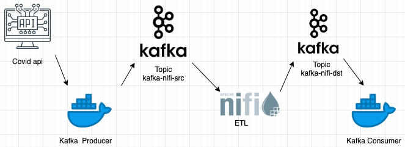
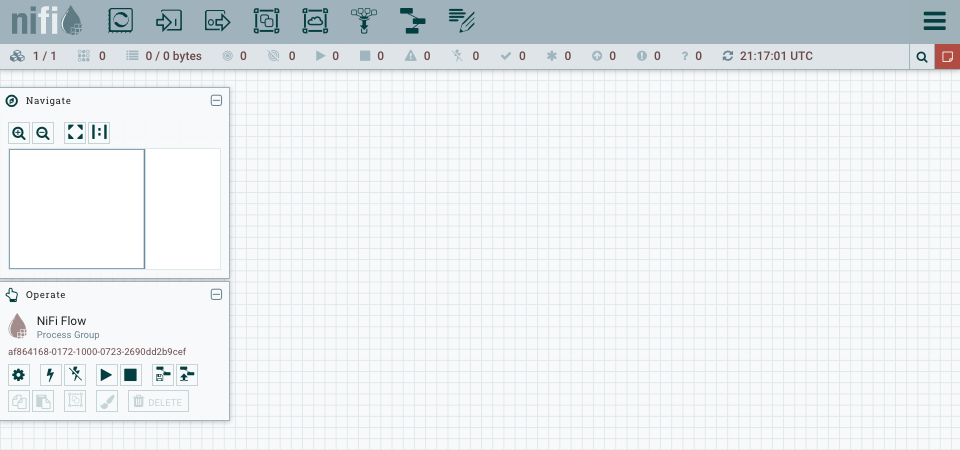
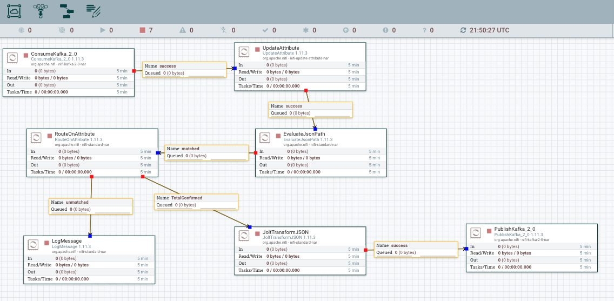
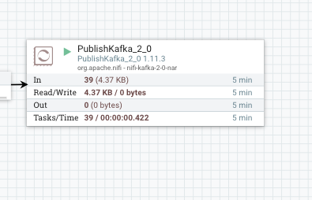
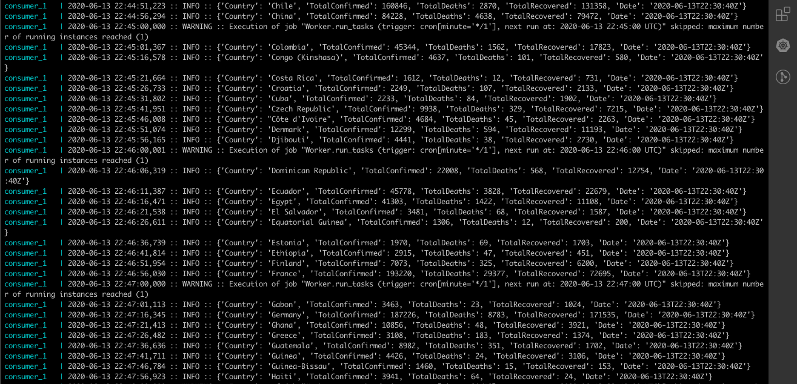

# **Apache-Nifi-Kafka**

This project is a example that show how it's possible  connect apache nifi with kafka for consume from Kafka and produce to Kafka. For this example I used a Covid api. 

## **Architecture of the project**




## **Prerequisites**

* Docker
* Docker Compose

## **Implementation**

1. Clone the repository and export your IP private as a variable; Eg:

```
export IP=$(ipconfig getifaddr en0)
```

2. Run the Docker Compose:
```
docker-compose up
```

3. Visit the apache nifi web site in http://localhost:8080



4. Upload *nifi-templates/nifi-covid-kafka.xml*  in the Section **Operate**  in the bottom on the page, once the template was uploaded you should  drag the template in the toolbar on the top on the page and select the template uploaded.



5. Start the project and you should check if the  __*PublishKafka*__ procesor has received messages.

<p align="center">

</p>

## **Checking**

You can check the logs on the *consumer*  and see that the *consumer* only show the messages with countries that have more than 1000 cases of COVID-19 confirmed.

```
docker-compose logs -f consumer
```




